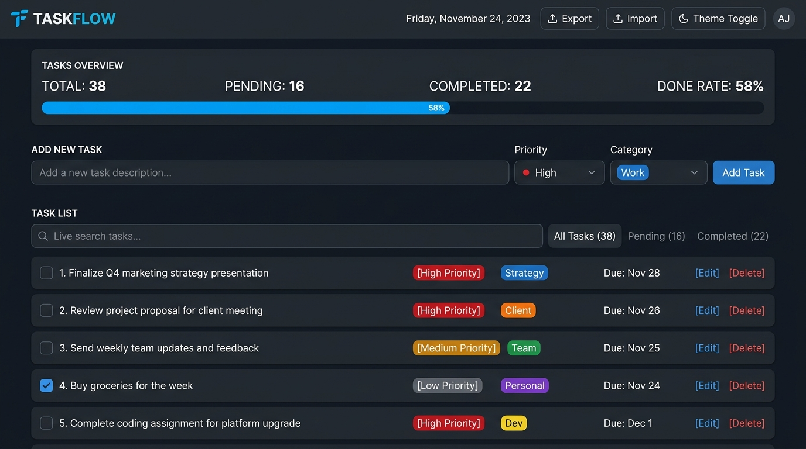

# TaskFlow - Modern To-Do App

A clean, responsive, and lightweight task management web application built with vanilla HTML, CSS, and JavaScript.



## Live Demo

- **Live URL (GitHub Pages):** https://olied-ahmed-chowdhury.github.io/ToDo_list_app/
- **Alternative Free Hosting:** Ready for one-click deployment on Netlify, Vercel, or Cloudflare Pages.

## Features

- **Task Management:** Create, edit, complete, and delete tasks with instant UI updates.
- **Priorities and Categories:** Assign Low, Medium, or High priority levels and group tasks by category (Work, Personal, Study, Health, General).
- **Due Dates and Deadlines:** Track task deadlines with real-time status indicators (Due Today, Overdue, Upcoming).
- **Search and Filtering:** Instantly search tasks by title or category, and filter by status (All, Pending, Completed).
- **Sorting Options:** Sort tasks by creation date, due date, priority level, or alphabetically.
- **Progress Tracking:** Live statistics overview displaying total, pending, completed counts, and completion rate progress bar.
- **Data Backup and Restore:** One-click JSON export and import for seamless local backups.
- **Dark and Light Theme:** Built-in theme switcher with local storage persistence.
- **Keyboard Shortcuts:** Quick task search using `/` and modal dismiss with `Escape`.

## Getting Started

### Run Locally

1. Clone or download this repository.
2. Open `index.html` directly in any web browser, or serve it locally:

```bash
npx serve .
```

### Deploy to Netlify / Vercel / Cloudflare Pages

This is a static web app with zero build step:
- **Netlify:** Drag and drop this folder onto https://app.netlify.com/drop or connect your GitHub repository.
- **Vercel:** Import your GitHub repository on https://vercel.com/new and deploy with default settings.
- **Cloudflare Pages:** Connect your GitHub repository on Cloudflare Pages dashboard and set root directory to `/`.

## Technologies

- **HTML5:** Semantic document structure and accessible form elements.
- **CSS3:** Custom design tokens, dark/light themes, flexbox/grid layout, and responsive styles.
- **JavaScript (ES6):** Modular state management, DOM rendering, and LocalStorage persistence.

## Author

**Olied Ahmed Chowdhury**  
GitHub: https://github.com/Olied-Ahmed-chowdhury
